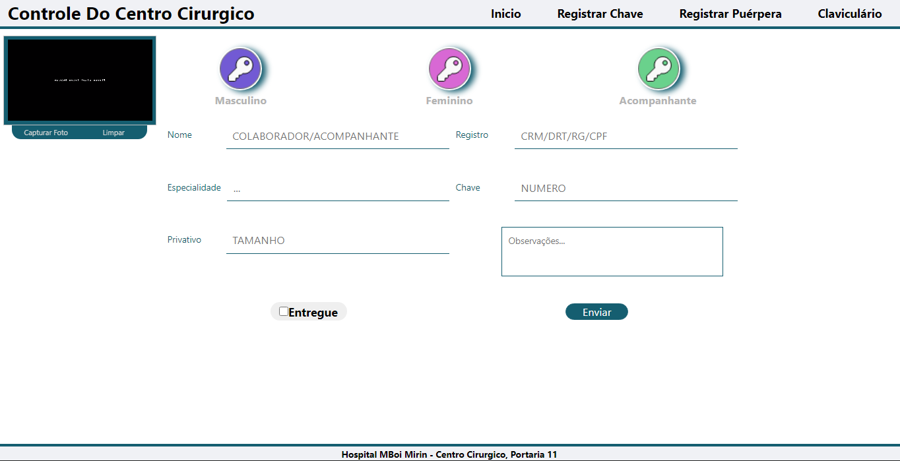
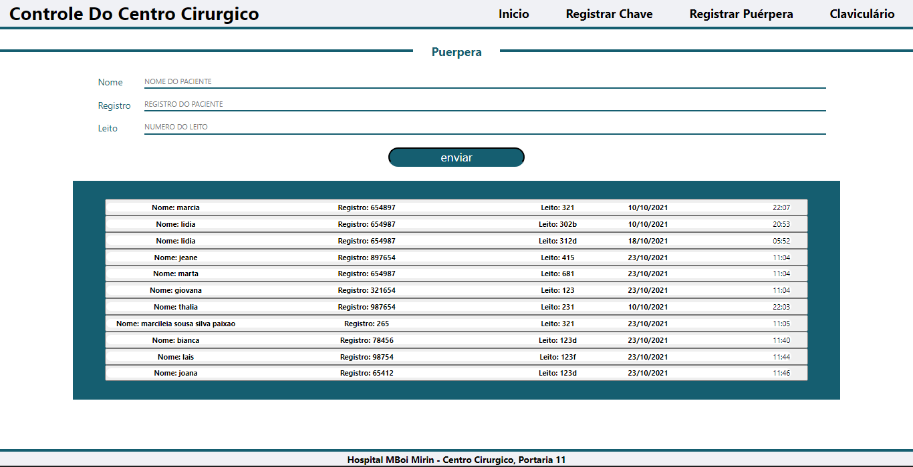

## Essa aplicalçao por ser a primeira lidei com muitos problemas, mas foi gratificante realizala...

Implementar hooks para um iniciante e realmente um desafio as vezes, mas com muito esforço eu conseguir usar diversos aqui nesse App.

## Back-End
O back-end foi um desafio a parte nesse App, porque eu lidei com outro ambiente que não tinha 
familiaridade ate então, que no caso foi **NodeJs** e para banco de dados **MongoDb**.  

## Deploy
esta aplicação esta hospedada na **Heroku**, recomendo a todos que estejam estudando Next.js fazer o deploy na **Heroku** Além de facil e de graça. 

## Cadastro

## Cadastro de puerperas 

[Ir Para a Aplicação](https://frontendcc.herokuapp.com/). 